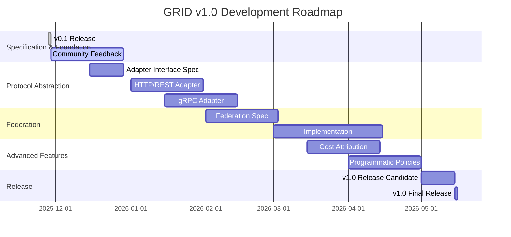

# GRID Protocol Roadmap: The Path to v1.0

This document outlines the key features and development phases planned for the GRID Protocol v1.0 release. Our goal is to build on the solid foundation of v0.1 and deliver a truly universal, multi-protocol, and federated governance solution.

## v1.0 Themes

The development of GRID v1.0 will be guided by the following core themes:

*   **Universal Interoperability:** Extend GRID beyond MCP to support a wide range of protocols, including HTTP/REST, gRPC, and more.
*   **Federated Governance:** Enable seamless, secure, and decentralized governance across organizational boundaries.
*   **Enhanced Policy Control:** Introduce more advanced policy capabilities, including programmatic policies and cost attribution.
*   **Community-Driven Development:** Actively incorporate community feedback and contributions to ensure GRID meets the needs of a diverse range of use cases.

## Path to v1.0

The following diagram illustrates the major milestones on the path to GRID v1.0:

## v1.0 Feature Breakdown

The following table provides a more detailed breakdown of the features planned for v1.0, along with their current status and estimated effort.

| Feature                      | Status      | Description                                                                                             |
| ---------------------------- | ----------- | ------------------------------------------------------------------------------------------------------- |
| **Protocol Abstraction**     |             |                                                                                                         |
| Protocol Adapter Interface   | `Not Started` | Formalize the abstract interface for creating new protocol adapters.                                    |
| HTTP/REST Adapter            | `Not Started` | Implement a reference adapter for governing HTTP/REST APIs.                                             |
| gRPC Adapter                 | `Not Started` | Implement a reference adapter for governing gRPC services.                                              |
| **Federation**               |             |                                                                                                         |
| Federation Protocol          | `Not Started` | Specify the protocol for establishing trust and exchanging information between GRID nodes.            |
| Cross-Org Policy Evaluation  | `Not Started` | Enable a GRID node in one organization to evaluate policies for a principal from another organization. |
| **Advanced Policy Features** |             |                                                                                                         |
| Cost Attribution System      | `Not Started` | Introduce a standardized model for tracking and attributing costs to resource usage.                  |
| Programmatic Policies        | `Not Started` | Allow for the implementation of complex, custom policy logic in a programmatic language.                |
| **Other Enhancements**       |             |                                                                                                         |
| Formalized Delegation Model  | `Not Started` | Improve the audit trail and policy control for delegated actions.                                       |
| Standardized Rate Limiting   | `Not Started` | Define a standard set of headers for communicating rate limit information.                              |

## How to Contribute

The GRID project is community-driven, and we welcome contributions of all kinds. If you are interested in helping us build the future of decentralized governance, please see our [CONTRIBUTING.md](docs/community/CONTRIBUTING.md) guide for more information.

We are particularly looking for help in the following areas:

*   **Protocol Adapter Development:** If you have expertise in a particular protocol, we would love your help in building a GRID adapter for it.
*   **Policy Examples:** We are always looking for more real-world policy examples to help users get started.
*   **Documentation and Tutorials:** Help us improve the documentation and create new tutorials to make GRID more accessible to everyone.

We are excited about the path to v1.0 and look forward to working with the community to make it a reality.