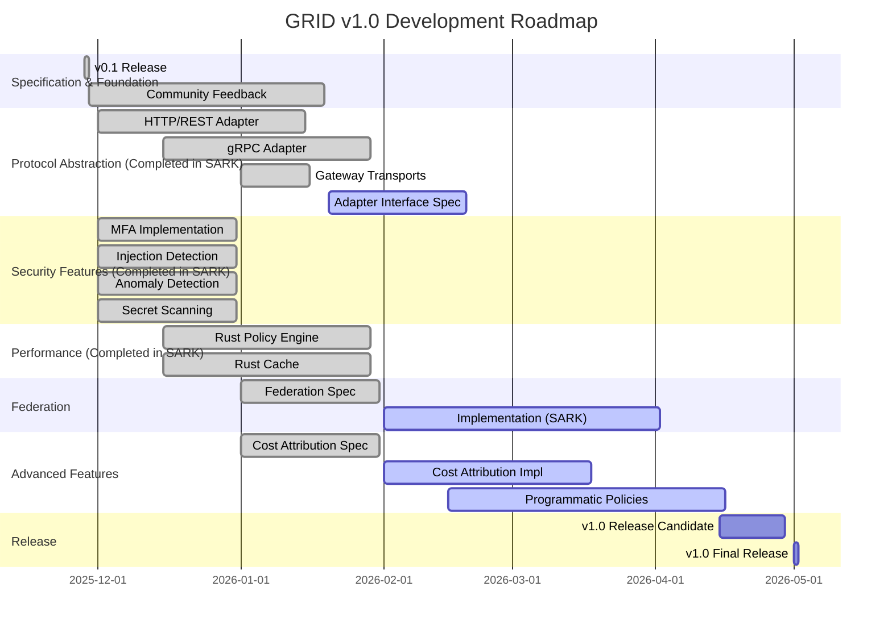

# GRID Protocol Roadmap: The Path to v1.0

This document outlines the key features and development phases planned for the GRID Protocol v1.0 release. Our goal is to build on the solid foundation of v0.1 and deliver a truly universal, multi-protocol, and federated governance solution.

## v1.0 Themes

The development of GRID v1.0 will be guided by the following core themes:

*   **Universal Interoperability:** Extend GRID beyond MCP to support a wide range of protocols, including HTTP/REST, gRPC, and more.
*   **Federated Governance:** Enable seamless, secure, and decentralized governance across organizational boundaries.
*   **Enhanced Policy Control:** Introduce more advanced policy capabilities, including programmatic policies and cost attribution.
*   **Community-Driven Development:** Actively incorporate community feedback and contributions to ensure GRID meets the needs of a diverse range of use cases.

## Path to v1.0

The following diagram illustrates the major milestones on the path to GRID v1.0:

```mermaid
gantt
    title GRID v1.0 Development Roadmap
    dateFormat  YYYY-MM-DD
    section Specification & Foundation
    v0.1 Release          :done, 2025-11-28, 1d
    Community Feedback    :done, 2025-11-29, 51d

    section Protocol Abstraction (Completed in SARK)
    HTTP/REST Adapter      :done, 2025-12-01, 45d
    gRPC Adapter         :done, 2025-12-15, 45d
    Gateway Transports     :done, 2026-01-01, 15d
    Adapter Interface Spec :active, 2026-01-20, 30d

    section Security Features (Completed in SARK)
    MFA Implementation     :done, 2025-12-01, 30d
    Injection Detection    :done, 2025-12-01, 30d
    Anomaly Detection      :done, 2025-12-01, 30d
    Secret Scanning        :done, 2025-12-01, 30d

    section Performance (Completed in SARK)
    Rust Policy Engine     :done, 2025-12-15, 45d
    Rust Cache             :done, 2025-12-15, 45d

    section Federation
    Federation Spec        :done, 2026-01-01, 30d
    Implementation (SARK)  :active, 2026-02-01, 60d

    section Advanced Features
    Cost Attribution Spec  :done, 2026-01-01, 30d
    Cost Attribution Impl  :active, 2026-02-01, 45d
    Programmatic Policies  :active, 2026-02-15, 60d

    section Release
    v1.0 Release Candidate :2026-04-15, 14d
    v1.0 Final Release     :2026-05-01, 1d
```

## v1.0 Feature Breakdown

The following table provides a more detailed breakdown of the features planned for v1.0, along with their current status and estimated effort.

| Feature                      | Status      | SARK Status | Description                                                                                             |
| ---------------------------- | ----------- | ----------- | ------------------------------------------------------------------------------------------------------- |
| **Protocol Abstraction**     |             |             |                                                                                                         |
| Protocol Adapter Interface   | `In Progress` | Spec drafted (v2.0) | Formalize the abstract interface for creating new protocol adapters.                                    |
| HTTP/REST Adapter            | ✅ `Implemented` | v1.5.0+ | Implement a reference adapter for governing HTTP/REST APIs with OpenAPI discovery.                                             |
| gRPC Adapter                 | ✅ `Implemented` | v1.5.0+ | Implement a reference adapter for governing gRPC services with reflection and mTLS.                                              |
| Gateway Transports           | ✅ `Implemented` | v1.5.0+ | HTTP, SSE, and stdio transport implementations for MCP Gateway.                                         |
| **Security Enhancements**    |             |             |                                                                                                         |
| MFA (Multi-Factor Auth)      | ✅ `Implemented` | v1.3.0 | TOTP, SMS, Push, and Email MFA methods with sensitivity-based policies.                                |
| Prompt Injection Detection   | ✅ `Implemented` | v1.3.0 | 20+ attack patterns with entropy analysis, <3ms latency.                                                |
| Secret Scanning              | ✅ `Implemented` | v1.3.0 | 25+ secret types with auto-redaction, <1ms latency.                                                     |
| Anomaly Detection            | ✅ `Implemented` | v1.3.0 | Behavioral baseline with 7 anomaly types and real-time alerts.                                          |
| Network Security Controls    | ✅ `Implemented` | v1.3.0 | Kubernetes NetworkPolicy and egress filtering.                                                          |
| **Performance Optimization** |             |             |                                                                                                         |
| Rust Policy Engine           | ✅ `Implemented` | v1.4.0 | 4-10x faster policy evaluation with automatic Python fallback.                                          |
| Rust In-Memory Cache         | ✅ `Implemented` | v1.4.0 | 10-50x faster than Redis, <0.5ms latency.                                                               |
| **Federation**               |             |             |                                                                                                         |
| Federation Protocol          | `Spec Ready` | Spec (v2.0) | Specify the protocol for establishing trust and exchanging information between GRID nodes with mTLS.            |
| Cross-Org Policy Evaluation  | `Spec Ready` | Spec (v2.0) | Enable a GRID node in one organization to evaluate policies for a principal from another organization. |
| **Advanced Policy Features** |             |             |                                                                                                         |
| Cost Attribution System      | `Spec Ready` | Spec (v2.0) | Introduce a standardized model for tracking and attributing costs to resource usage with budget enforcement.                  |
| Programmatic Policies        | `In Progress` | Infrastructure (v1.6.0) | Allow for the implementation of complex, custom policy logic in a programmatic language.                |
| **Other Enhancements**       |             |             |                                                                                                         |
| Formalized Delegation Model  | `Not Started` | - | Improve the audit trail and policy control for delegated actions.                                       |
| Standardized Rate Limiting   | ✅ `Implemented` | v1.3.0 | Standard rate limiting with quotas, circuit breakers, and backpressure.                              |

## How to Contribute

The GRID project is community-driven, and we welcome contributions of all kinds. If you are interested in helping us build the future of decentralized governance, please see our [CONTRIBUTING.md](docs/community/CONTRIBUTING.md) guide for more information.

We are particularly looking for help in the following areas:

*   **Protocol Adapter Development:** If you have expertise in a particular protocol, we would love your help in building a GRID adapter for it.
*   **Policy Examples:** We are always looking for more real-world policy examples to help users get started.
*   **Documentation and Tutorials:** Help us improve the documentation and create new tutorials to make GRID more accessible to everyone.

We are excited about the path to v1.0 and look forward to working with the community to make it a reality.