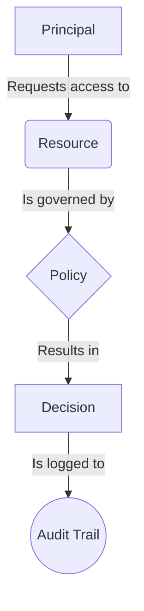
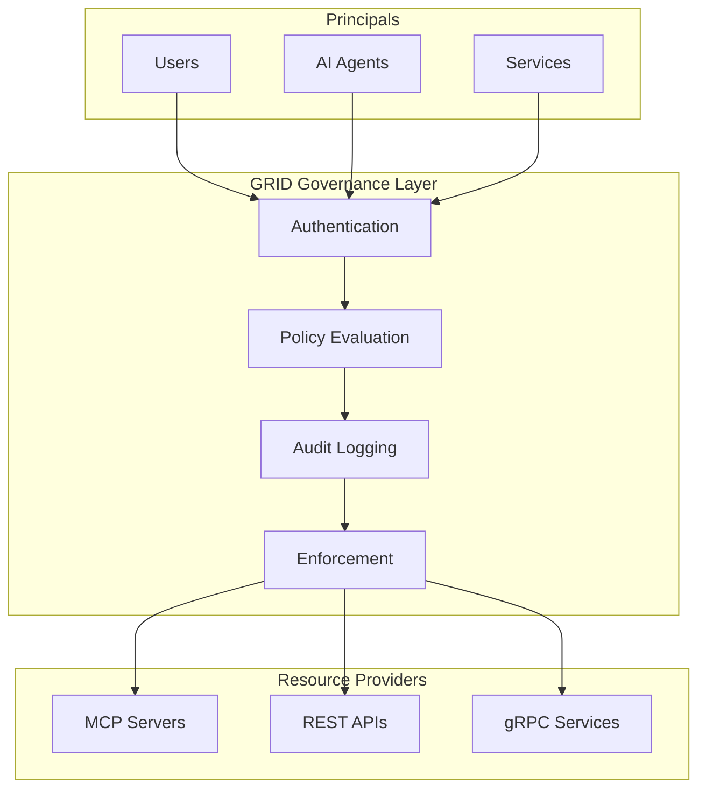
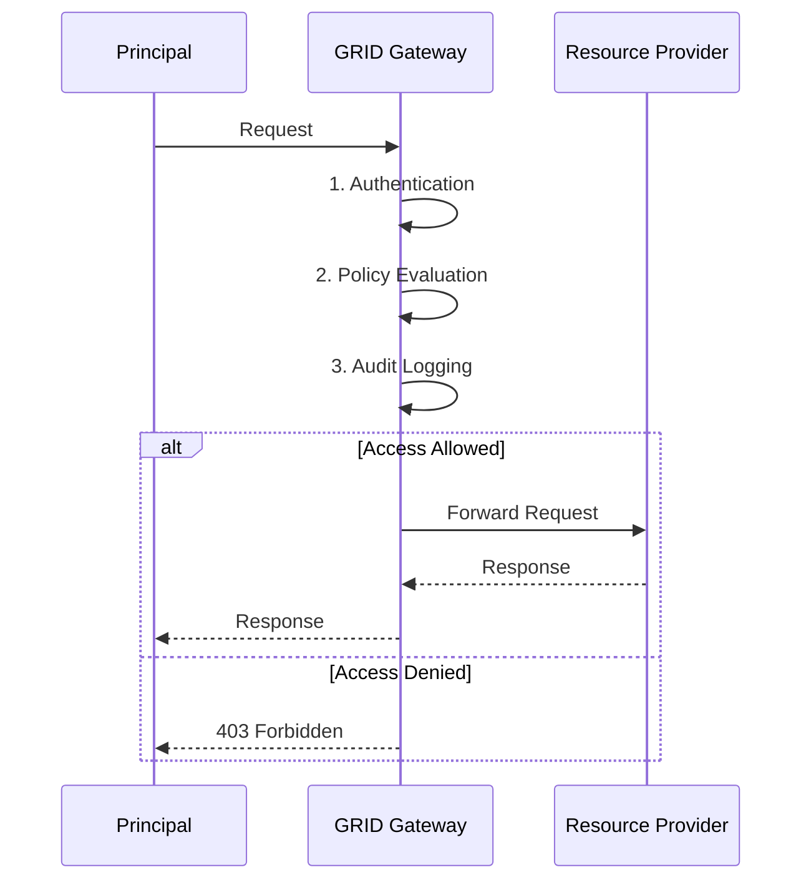

# GRID Protocol Visual Guide

This document provides a visual guide to the GRID protocol, with diagrams illustrating the core concepts, architecture, and flows.

## Table of Contents

- [Core Concepts](#core-concepts)
- [Architecture](#architecture)
- [Flows](#flows)
- [Use Cases](#use-cases)

---

## Core Concepts

### The Five Core Abstractions

This diagram illustrates the five core abstractions of the GRID protocol and how they relate to each other.



---

## Architecture

### Reference Architecture

This diagram shows the high-level reference architecture for a GRID implementation.



---

## Flows

### Request Flow

This diagram illustrates the flow of a request through the GRID governance layer.



---

## Use Cases

### AI Agent Tool Access

This diagram illustrates how GRID can be used to govern AI agent tool access.

```mermaid
sequenceDiagram
    participant U as User
    participant A as AI Agent
    participant G as GRID Gateway
    participant T as Tool

    U->>A: "Show me all bugs assigned to my team"
    A->>G: Evaluate policy for jira.search tool
    G-->>A: Allow
    A->>T: Invoke jira.search tool
    T-->>A: Tool result
    A-->>U: "Here are the bugs..."