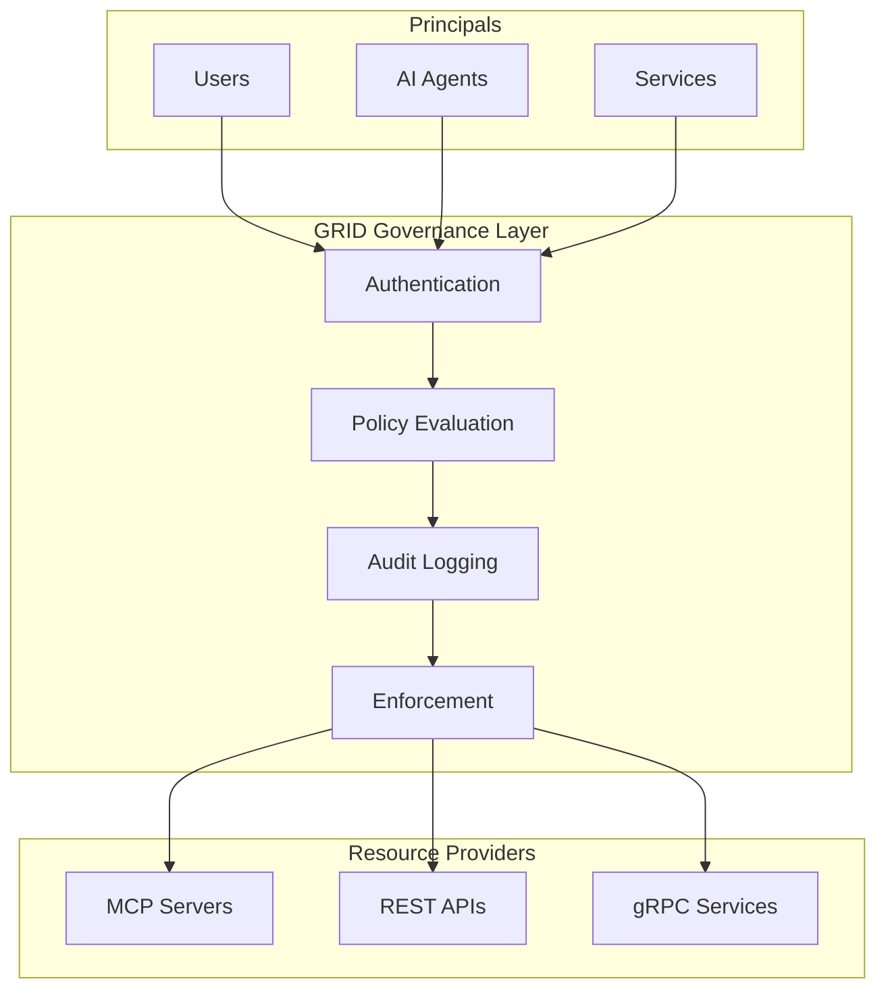

```mermaid
graph TD
    subgraph Principals
        A[Users]
        B[AI Agents]
        C[Services]
    end

    subgraph GRID Governance Layer
        D[Authentication] --> E[Policy Evaluation]
        E --> F[Audit Logging]
        F --> G[Enforcement]
    end

    subgraph Resource Providers
        H[MCP Servers]
        I[REST APIs]
        J[gRPC Services]
    end

    A & B & C --> D
    G --> H & I & J
```