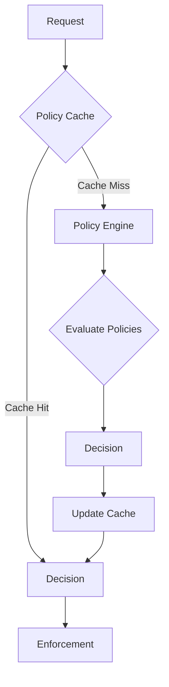

```mermaid
graph TD
    A[Request] --> B{Policy Cache}
    B -->|Cache Hit| C[Decision]
    B -->|Cache Miss| D[Policy Engine]
    D --> E{Evaluate Policies}
    E --> F[Decision]
    F --> G[Update Cache]
    G --> C
    C --> H[Enforcement]
```