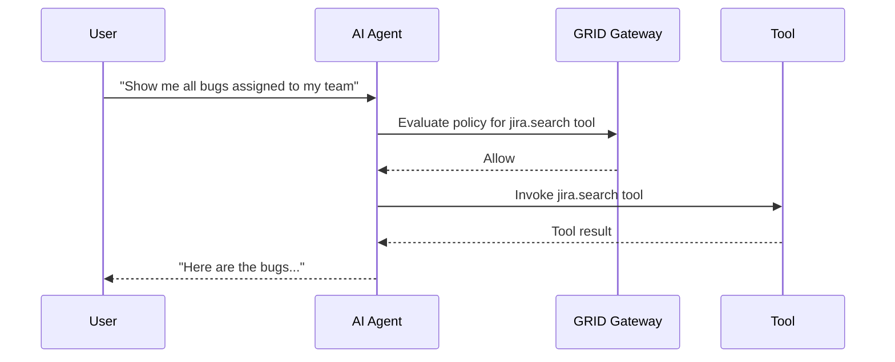

```mermaid
sequenceDiagram
    participant U as User
    participant A as AI Agent
    participant G as GRID Gateway
    participant T as Tool

    U->>A: "Show me all bugs assigned to my team"
    A->>G: Evaluate policy for jira.search tool
    G-->>A: Allow
    A->>T: Invoke jira.search tool
    T-->>A: Tool result
    A-->>U: "Here are the bugs..."
```